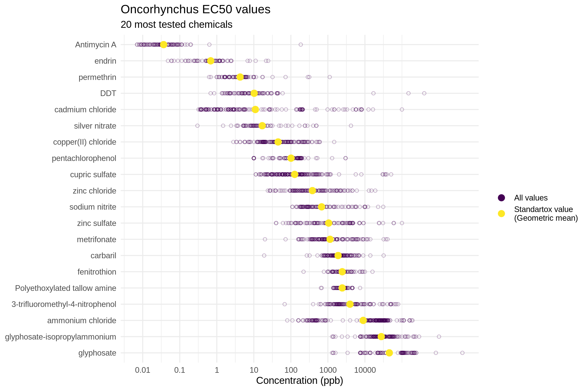

Standartox
================

Standartox is a data base tool facilitating the retrieval of ecotoxicological test data. It is based on the [EPA ECOTOX data base](https://cfpub.epa.gov/ecotox/) as well as on data from several other chemical data bases and allows users to filter and aggregate ecotoxicological test data in an easy way. It can either be accessed via a [web-app](http://standartox.uni-landau.de/) or via the R-package [standartox](https://github.com/andschar/standartox). Ecotoxicological test data is used in environmental risk assessment to calculate effect measures such as [TU - Toxic Units](https://en.wikipedia.org/wiki/Toxic_unit) or [SSD - Species Sensitivity Distributions](https://edild.github.io/ssd/) in order to asses environmental toxicity of chemicals.

The project lives in these three repositories:

-   [standartox-build](https://github.com/andschar/standartox-build) - Compiles the tool
-   [standartox-app](https://github.com/andschar/standartox-app) - Serves the website and API
-   [standartox](https://github.com/andschar/standartox) - R-package

Installation
------------

``` r
# remotes::install_github('andschar/standartox') # package not yet on CRAN
require(standartox)
```

Functions
---------

Standartox consists of the two functions `stx_catalog()` and `stx_query()`. The former allows you to retrieve a catalog of possible parameters that can be used as an input for `stx_query()`. The latter fetches toxicity values from the data base.

### `stx_catalog()`

The function returns a list of all possible arguments that can bes use in `stx_query()`.

``` r
catal = stx_catalog()
```

``` r
names(catal)
```

    ##  [1] "vers"               "casnr"              "concentration_type"
    ##  [4] "chemical_class"     "taxa"               "habitat"           
    ##  [7] "region"             "duration"           "effect"            
    ## [10] "endpoint"

``` r
catal$endpoint # access the parameter endpoint
```

| variable |       n|  n\_total|  perc|
|:---------|-------:|---------:|-----:|
| NOEX     |  188882|    525306|    36|
| XX50     |  184167|    525306|    35|
| LOEX     |  152257|    525306|    29|

### `stx_query()`

The function allows you to filter and aggregate toxicity data according to the following parameters:

| argument            | example                                               |
|:--------------------|:------------------------------------------------------|
| vers                | 20190314                                              |
| casnr               | 7758987, 2921882, 1912249                             |
| concentration\_type | active ingredient, formulation, total                 |
| chemical\_class     | fungicide, herbicide, insecticide                     |
| taxa                | Oncorhynchus mykiss, Rattus norvegicus, Daphnia magna |
| habitat             | marine, brackish, freshwater                          |
| region              | africa, america\_north, america\_south                |
| duration            | 24, 96                                                |
| effect              | Mortality, Population, Growth                         |
| endpoint            | NOEX, XX50, LOEX                                      |

The function also allows you to pick the aggregation method:

| argument | example            |
|:---------|:-------------------|
| agg      | min, med, gmn, max |

You can type in parameters manually or subset the object returned by `stx_catalog()`:

``` r
cas = c(Copper2Sulfate = '7758-98-7',
        Permethrin = '52645-53-1',
        Imidacloprid = '138261-41-3')
# query
l = stx_query(cas = cas,
              endpoint = 'XX50',
              taxa = grep('Oncorhynchus', catal$taxa$variable, value = TRUE), # fish genus
              duration = c(24, 120))
```

#### NB

-   **CAS** (`casnr =`) Can be input in the form of 7758-98-7 or 7758987
-   **Endpoints** (`endpoint =`) Only one endpoint per query is allowed:
    -   `NOEX` summarises [No observed effect concentration/level](https://en.wikipedia.org/wiki/No-observed-adverse-effect_level) (i.e. NOEC, NOEL, NOAEL, etc.)
    -   `LOEX` summarises Lowest observed effects concentration (i.e. LOEC, LOEL, etc.)
    -   `XX50` summarises [Half maximal effective concentration](https://en.wikipedia.org/wiki/EC50) (i.e. EC50, LC50, LD50 etc.)
-   If you leave a parameter empty Standartox will not filter for it

Query result
------------

Standartox returns a list object with three entries, containing the filtered data:

``` r
l$filtered
```

| casnr    | cname          |  concentration| concentration\_unit | effect    | endpoint |
|:---------|:---------------|--------------:|:--------------------|:----------|:---------|
| 52645531 | permethrin     |           3.87| ppb                 | Mortality | XX50     |
| 7758987  | cupric sulfate |        1150.00| ppb                 | Mortality | XX50     |
| 52645531 | permethrin     |           4.30| ppb                 | Mortality | XX50     |

the aggregated data:

``` r
l$aggregated[ , -'taxa']
```

| cname          | casnr     |       min|       med|           gmn|       max|    n|
|:---------------|:----------|---------:|---------:|-------------:|---------:|----:|
| permethrin     | 52645531  |  1.80e-06|       4.2|  3.967545e+00|    9000.0|  116|
| cupric sulfate | 7758987   |  1.13e+01|     110.5|  1.354075e+02|  173974.9|  268|
| imidacloprid   | 138261413 |  8.30e+04|  156050.0|  1.378960e+05|  229100.0|    2|

and meta the information on the request:

``` r
l$meta
```

| variable            | value               |
|:--------------------|:--------------------|
| accessed            | 2019-09-30 18:53:33 |
| standartox\_version | 20190912            |
| standartox\_version | Version: 0.0.0.9000 |

Example: *Oncorhynchus*
-----------------------

Let's say, we want to retrieve the 20 most tested chemicals on the genus *[Oncorhynchus](https://en.wikipedia.org/wiki/Oncorhynchus)*. We allow for test durations between 48 and 120 hours and want the tests restricted to active ingredients only. Since we are only interested in the half maximal effective concentration, we choose XX50 as our endpoint. As an aggregation method we choose the geometric mean.

``` r
l2 = stx_query(concentration_type = 'active ingredient',
               endpoint = 'XX50',
               taxa = grep('Oncorhynchus', catal$taxa$variable, value = TRUE), # fish genus
               duration = c(48, 120),
               agg = 'gmn')
```

We subset the retrieved data to the 20 most tested chemicals and plot the result.

``` r
require(data.table)
dat = merge(l2$filtered, l2$aggregated, by = c('casnr', 'cname'))
casnr20 = l2$aggregated[ order(-n), casnr ][1:20]
dat = dat[ casnr %in% casnr20 ]
```

``` r
require(ggplot2)
ggplot(dat, aes(y = reorder(cname, -gmn))) +
  geom_point(aes(x = concentration, col = 'All values'),
             pch = 1, alpha = 0.3) +
  geom_point(aes(x = gmn, col = 'Standartox value\n(Geometric mean)'),
             size = 3) +
  scale_x_log10(breaks = c(0.01, 0.1, 1, 10, 100, 1000, 10000),
                labels = c(0.01, 0.1, 1, 10, 100, 1000, 10000)) +
  scale_color_viridis_d(name = '') +
  labs(title = 'Oncorhynchus EC50 values',
       subtitle = '20 most tested chemicals',
       x = 'Concentration (ppb)') +
  theme_minimal() +
  theme(axis.title.y = element_blank())
```



Usage
-----

We ask you to use the API service thoughtfully, which means to run the `stx_query()` only once and to re-run it only when parameters change or you want to query new versions. Here is an example of how to easily store the queried data locally from within R.

``` r
run = FALSE # set to TRUE for the first run
if (run) {
  l2 = stx_query(concentration_type = 'active ingredient',
                 endpoint = 'XX50',
                 taxa = grep('Oncorhynchus', catal$taxa$variable, value = TRUE), # fish genus
                 duration = c(48, 120))
  saveRDS(l2, file.path('path/to/directory', 'data.rds'))
  
} else {
  l2 = readRDS(file.path('path/to/directory', 'data.rds'))
}

# put rest of the script here
# ...
```

Article
-------

The article on Standartox is currently work in progress and will be, once published linked here.

Information
-----------

### Contributors

-   [Andreas Scharmüller](https://andschar.github.io)

### Want to contribute?

Checkout our [contribution guide here](https://github.com/andschar/standartox/blob/master/CONTRIBUTING.md).

### Meta

-   Please report any [issues, bugs or feature requests](https://github.com/andschar/standartox/issues)
-   License: MIT
-   Get citation information for webchem in R doing `citation(package = 'standartox')`
