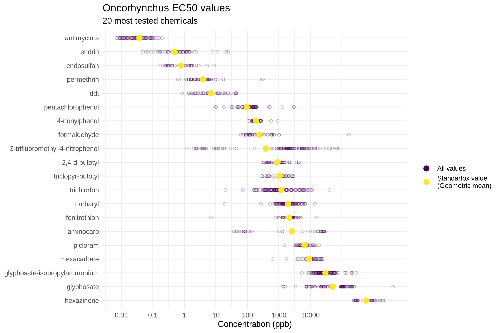

Standartox
================

[](https://cran.r-project.org/package=standartox)
[]()

<!-- TODO enable once it's on CRAN [](https://cran.r-project.org/package=standartox) -->

Standartox is a database and tool facilitating the retrieval of
ecotoxicological test data. It is based on the [EPA ECOTOX
database](https://cfpub.epa.gov/ecotox/) as well as on data from several
other chemical databases and allows users to filter and aggregate
ecotoxicological test data in an easy way. It can either be accessed via
<http://standartox.uni-landau.de> or this R-package
[standartox](https://github.com/andschar/standartox). Ecotoxicological
test data is used in environmental risk assessment to calculate effect
measures such as [TU - Toxic
Units](https://en.wikipedia.org/wiki/Toxic_unit) or [SSD - Species
Sensitivity Distributions](https://edild.github.io/ssd/) to asses
environmental toxicity of chemicals.

The project lives in two repositories:

  - [standartox-build](https://github.com/andschar/standartox-build) -
    Compiles and serves database
  - [standartox](https://github.com/andschar/standartox) - R-package

## Installation

``` r
# install.packages('remotes')
remotes::install_github('andschar/standartox') # package not yet on CRAN
```

## Functions

Standartox consists of the two functions `stx_catalog()` and
`stx_query()`. The former allows you to retrieve a catalog of possible
parameters that can be used as an input for `stx_query()`. The latter
fetches toxicity values from the database.

### `stx_catalog()`

The function returns a list of all possible arguments that can bes use
in `stx_query()`.

``` r
require(standartox)
catal = stx_catalog()
names(catal)
```

    ##  [1] "vers"               "casnr"              "cname"             
    ##  [4] "concentration_unit" "concentration_type" "chemical_role"     
    ##  [7] "chemical_class"     "taxa"               "trophic_lvl"       
    ## [10] "habitat"            "region"             "ecotox_grp"        
    ## [13] "duration"           "effect"             "endpoint"          
    ## [16] "exposure"

``` r
catal$endpoint # access the parameter endpoint
```

| variable |      n | n\_total | perc |
| :------- | -----: | -------: | ---: |
| NOEX     | 213692 |   558384 |   39 |
| LOEX     | 173111 |   558384 |   32 |
| XX50     | 171581 |   558384 |   31 |

### `stx_query()`

The function allows you to retrieve filtered and aggregated toxicity
data according to the parameters below.

| parameter           | example                                |
| :------------------ | :------------------------------------- |
| vers                | 20191212                               |
| casnr               | 50000, 95716, 95727                    |
| cname               | 2291, 4, 3                             |
| concentration\_unit | ug/l, mg/kg, g/m2                      |
| concentration\_type | active ingredient, formulation, total  |
| chemical\_role      | pesticide, herbicide, insecticide      |
| chemical\_class     | amide, aromatic, organochlorine        |
| taxa                | species, genus, Fusarium oxysporum     |
| trophic\_lvl        | heterotroph, autotroph                 |
| habitat             | freshwater, terrestrial, marine        |
| region              | america\_north, europe, america\_south |
| ecotox\_grp         | invertebrate, plant, fungi             |
| duration            | 24, 96                                 |
| effect              | Mortality, Population, Biochemistry    |
| endpoint            | NOEX, LOEX, XX50                       |
| exposure            | aquatic, environmental, diet           |

You can type in parameters manually or subset the object returned by
`stx_catalog()`:

``` r
require(standartox)
cas = c(Copper2Sulfate = '7758-98-7',
        Permethrin = '52645-53-1',
        Imidacloprid = '138261-41-3')
# query
l = stx_query(cas = cas,
              endpoint = 'XX50',
              taxa = grep('Oncorhynchus', catal$taxa$variable, value = TRUE), # fish genus
              exposure = 'aquatic',
              duration = c(24, 120))
```

    ## Standartox query running..
    ## Parameters:
    ## casnr: 7758-98-7, 52645-53-1, 138261-41-3
    ## duration: 24, 120
    ## endpoint: XX50
    ## exposure: aquatic
    ## taxa: Oncorhynchus clarkii, Oncorhynchus gilae, Oncorhynchus nerka, Oncorhyn...[truncated]

#### Important parameter settings

  - **CAS** (`cas =`) Can be input in the form of 7758-98-7 or 7758987
  - **Endpoints** (`endpoint =`) Only one endpoint per query is allowed:
      - `NOEX` summarises [No observed effect
        concentration/level](https://en.wikipedia.org/wiki/No-observed-adverse-effect_level)
        (i.e. NOEC, NOEL, NOAEL, etc.)
      - `LOEX` summarises Lowest observed effects concentration
        (i.e. LOEC, LOEL, etc.)
      - `XX50` summarises [Half maximal effective
        concentration](https://en.wikipedia.org/wiki/EC50) (i.e. EC50,
        LC50, LD50 etc.)
  - If you leave a parameter empty Standartox will not filter for it

## Query result

Standartox returns a list object with five entries.

  - `l$filtred` and `l$filtered_all` contain the filtered Standartox
    data set (the former only is a shorter and more concise version of
    the
latter):

| cas       | cname          | concentration | concentration\_unit | effect    | endpoint |
| :-------- | :------------- | ------------: | :------------------ | :-------- | :------- |
| 7758-98-7 | cupric sulfate |        1100.0 | ug/l                | Mortality | XX50     |
| 7758-98-7 | cupric sulfate |          18.9 | ug/l                | Mortality | XX50     |
| 7758-98-7 | cupric sulfate |          36.0 | ug/l                | Mortality | XX50     |

  - `l$aggregated` contains the several aggregates of the Standartox
    data:
    
      - `cname`, `cas` - chemical identifiers
      - `min` - Minimum
      - `tax_min` - Most sensitive taxon
      - **`gmn`** - **Geometric mean**
      - `amn` - Arithmetic mean
      - `sd` - Standard Deviation of the arithmetic mean
      - `max` - Maximum
      - `tax_max` - Most insensitive taxon
      - `n` - Number of distinct taxa used for the aggregation
      - `tax_all` - Concatenated string of all taxa used for the
        aggregation

| cname          | cas         |          min | tax\_min             |          gmn |         max |
| :------------- | :---------- | -----------: | :------------------- | -----------: | ----------: |
| cupric sulfate | 7758-98-7   | 6.813740e+01 | Oncorhynchus clarkii | 1.330055e+02 |    263.6153 |
| imidacloprid   | 138261-41-3 | 2.291000e+05 | Oncorhynchus mykiss  | 2.291000e+05 | 229100.0000 |
| permethrin     | 52645-53-1  | 1.896481e+00 | Oncorhynchus gilae   | 4.505877e+00 |     17.0000 |

  - `l$id` contains important data identifiers:
      - `cname`, `cas`
      - `inchikey`, `inchi`
      - `result_id` - result ID from the underlying data source
        (i.e. EPA)
      - `species_number` - taxon ID from the underlying data source
        (i.e. EPA)
      - `ref_number` - reference ID from the underlying data source
        (i.e. EPA)

| cname          | cas         | result\_id | species\_number | ref\_number |
| :------------- | :---------- | ---------: | --------------: | ----------: |
| cupric sulfate | 7758-98-7   |     114026 |               4 |         104 |
| imidacloprid   | 138261-41-3 |    2109867 |               4 |         344 |
| permethrin     | 52645-53-1  |    2103751 |               4 |         344 |

  - `l$meta` contains meta information on the request:

| variable            | value               |
| :------------------ | :------------------ |
| accessed            | 2020-05-13 10:53:54 |
| standartox\_version | 20191212            |

## Example: *Oncorhynchus*

Let’s say, we want to retrieve the 20 most tested chemicals on the genus
*[Oncorhynchus](https://en.wikipedia.org/wiki/Oncorhynchus)*. We allow
for test durations between 48 and 120 hours and want the tests
restricted to active ingredients only. Since we are only interested in
the half maximal effective concentration, we choose XX50 as our
endpoint. As an aggregation method we choose the geometric mean.

``` r
require(standartox)
l2 = stx_query(concentration_type = 'active ingredient',
               endpoint = 'XX50',
               taxa = grep('Oncorhynchus', catal$taxa$variable, value = TRUE), # fish genus
               duration = c(48, 120))
```

    ## Standartox query running..
    ## Parameters:
    ## concentration_type: active ingredient
    ## duration: 48, 120
    ## endpoint: XX50
    ## taxa: Oncorhynchus clarkii, Oncorhynchus gilae, Oncorhynchus nerka, Oncorhyn...[truncated]

We subset the retrieved data to the 20 most tested chemicals and plot
the result.

``` r
require(data.table)
dat = merge(l2$filtered, l2$aggregated, by = c('cas', 'cname'))
cas20 = l2$aggregated[ order(-n), cas ][1:20]
dat = dat[ cas %in% cas20 ]
```

``` r
require(ggplot2)
ggplot(dat, aes(y = reorder(cname, -gmn))) +
  geom_point(aes(x = concentration, col = 'All values'),
             pch = 1, alpha = 0.3) +
  geom_point(aes(x = gmn, col = 'Standartox value\n(Geometric mean)'),
             size = 3) +
  scale_x_log10(breaks = c(0.01, 0.1, 1, 10, 100, 1000, 10000),
                labels = c(0.01, 0.1, 1, 10, 100, 1000, 10000)) +
  scale_color_viridis_d(name = '') +
  labs(title = 'Oncorhynchus EC50 values',
       subtitle = '20 most tested chemicals',
       x = 'Concentration (ppb)') +
  theme_minimal() +
  theme(axis.title.y = element_blank())
```

<!-- -->

## Usage

We ask you to use the API service thoughtfully, which means to run the
`stx_query()` only once and to re-run it only when parameters change or
you want to query new versions. Here is an example of how to easily
store the queried data locally from within R.

``` r
run = FALSE # set to TRUE for the first run
if (run) {
  l2 = stx_query(concentration_type = 'active ingredient',
                 endpoint = 'XX50',
                 taxa = grep('Oncorhynchus', catal$taxa$variable, value = TRUE), # fish genus
                 duration = c(48, 120))
  saveRDS(l2, file.path('path/to/directory', 'data.rds'))
  
} else {
  l2 = readRDS(file.path('path/to/directory', 'data.rds'))
}

# put rest of the script here
# ...
```

## Article

The article on Standartox is currently work in progress and will be,
once published linked here.

## Information

### Contributors

  - [Andreas Scharmüller](https://andschar.github.io)

### Want to contribute?

Check out our [contribution guide
here](https://github.com/andschar/standartox/blob/master/CONTRIBUTING.md).

### Meta

  - Please report any [issues, bugs or feature
    requests](https://github.com/andschar/standartox/issues)
  - License: MIT
  - Get citation information for the standartox package in R doing
    `citation(package = 'standartox')`
