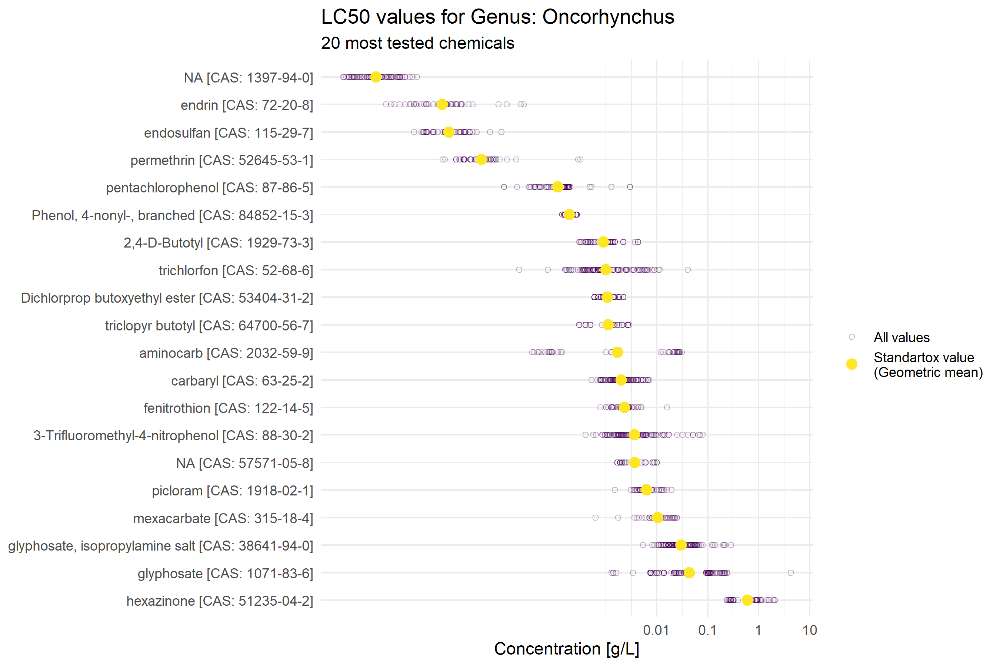

Standartox
================

[](https://CRAN.R-project.org/package=standartox)
[](https://cran.r-project.org/package=standartox)

Standartox is a database and tool facilitating the retrieval of
ecotoxicological test data. It is based on the [EPA ECOTOX
database](https://cfpub.epa.gov/ecotox/) as well as on data from several
other chemical databases and allows users to filter and aggregate
ecotoxicological test data in an easy way. It can be accessed via this
R-package [standartox](https://github.com/andschar/standartox).
Ecotoxicological test data is used in environmental risk assessment to
calculate effect measures such as [TU - Toxic
Units](https://en.wikipedia.org/wiki/Toxic_unit) or [SSD - Species
Sensitivity Distributions](https://edild.github.io/ssd/) to asses
environmental toxicity of chemicals.

## Installation

***NOTE:*** Currently v0.0.2 is only available here on GitHub.

``` r
# install.packages('standartox') # Currently only available on GitHub
if (!requireNamespace("standartox", quietly = TRUE)) {
  remotes::install_github('andschar/standartox') # development version
}
```

## Functions

Standartox mainly consists of the functions `stx_catalog()` and
`stx_query()`. The former allows you to retrieve a summary catalog of
the data. The latter querries and aggregates the data from the database.
There are also `stx_data()`, `stx_chem()`, `stx_taxa()` and `stx_meta()`
funcitons which fetch the whole toxicity, chemical, taxonomic and meta
data tables respectively.

### `stx_catalog()`

The function returns a list of all possible arguments that can bes use
in `stx_query()`.

``` r
require(standartox)
require(data.table)
catal = stx_catalog()
names(catal)
```

    ##  [1] "date_compiled"           "standartox_version"      "cas"                     "chem_class"             
    ##  [5] "cname"                   "ref_author"              "ref_number"              "ref_title"              
    ##  [9] "ref_year"                "class"                   "continent"               "family"                 
    ## [13] "genus"                   "group"                   "habitat"                 "order"                  
    ## [17] "rank"                    "taxon"                   "casnr"                   "cl_id"                  
    ## [21] "concentration"           "concentration_orig"      "concentration_type"      "concentration_unit"     
    ## [25] "concentration_unit_orig" "duration"                "duration_orig"           "duration_unit"          
    ## [29] "duration_unit_orig"      "effect"                  "endpoint"                "endpoint_group"         
    ## [33] "exposure"                "qualifier"               "ref_number"              "result_id"              
    ## [37] "tl_id"

``` r
catal$endpoint # access the parameter top five endpoints
```

Showing the top 10 endpoint values from `stx_catalog()`

|      n | variable |
|-------:|:---------|
| 202306 | NOEL     |
| 191672 | NR       |
| 162103 | LOEL     |
| 152748 | NOEC     |
| 135906 | LC50     |
| 113089 | LOEC     |
|  53417 | EC50     |
|  22027 | BCF      |
|  17337 | NR-LETH  |
|  16179 | LD50     |

### `stx_query()`

The function allows you to query and filter the standartox data base.

The most basic function call will return a data table filtered with
default settings: `endpoint_group = c("XX50", "NOEX", "LOEX")` and
`duration_unit = "h"`.

By setting `verbose = TRUE` the user can follow all the query steps in
more detail.

    ## Querying Standartox data base ...

    ## Reading in Standartox Data ...

    ## fstcore package v0.10.0

    ## (OpenMP detected, using 8 threads)

    ## Removing rows with 'NR' (not reported) for endpoint & duration_unit ...

    ## Appending chemical information ...

    ## Appending taxonomic information ...

    ## Done!

## Example: *Oncorhynchus*

Let’s say, we want to retrieve the 20 most tested chemicals on the genus
*[Oncorhynchus](https://en.wikipedia.org/wiki/Oncorhynchus)*. We allow
for test durations between 48 and 120 hours and want the tests
restricted to active ingredients only. Since we are only interested in
the half maximal effective concentration, we choose XX50 as our
endpoint. As an aggregation method we choose the geometric mean. The
code below makes use of the data.table package.

``` r
# Run query
oncor = stx_query(
  tax_genus = 'Oncorhynchus',
  endpoint_group = 'XX50',
  concentration_unit = 'g/l',
  effect = 'mortality',
  duration = c(48, 120),
  concentration_type = 'active ingredient',
  verbose = TRUE
)
```

    ## Querying Standartox data base ...

    ## Reading in Standartox Data ...

    ## Removing rows with 'NR' (not reported) for endpoint & duration_unit ...

    ## Appending chemical information ...

    ## Appending taxonomic information ...

    ## Done!

We subset the retrieved data to the 20 most tested chemicals and plot
the result.

``` r
cas20 = oncor[ , .N, cas ][ order(-N) ][1:20]
oncor20 = oncor[ cas %in% cas20$cas ]
# add new column which combines cname & cas
oncor20[ , cname := paste0(cname, ' [CAS: ', cas, ']') ]
gmn_dt = oncor20[ , .(gmn = exp(mean(log(concentration), na.rm = TRUE))), .(cas, cname, tax_genus)]
```

``` r
require(ggplot2)
ggplot(oncor20, aes(y = cname)) +
  geom_point(aes(x = concentration, col = 'All values'),
             pch = 1, alpha = 0.3) +
  geom_point(data = gmn_dt,
             aes(y = reorder(cname, -gmn), x = gmn, col = 'Standartox value\n(Geometric mean)'),
             size = 3) +
  scale_x_log10(breaks = c(0.01, 0.1, 1, 10, 100, 1000, 10000),
                labels = c(0.01, 0.1, 1, 10, 100, 1000, 10000)) +
  scale_color_viridis_d(name = '') +
  labs(title = 'LC50 values for Genus: Oncorhynchus',
       subtitle = '20 most tested chemicals',
       x = 'Concentration [g/L]') +
  theme_minimal() +
  theme(axis.title.y = element_blank())
```

<!-- -->

``` r
# Antimycin A (CAS 1397-94-0) listed as NA in standartox! Need to check this ... 
```

## Article

The article on Standartox is published
[here](https://www.mdpi.com/2306-5729/5/2/46).

## Contributors

### Want to contribute?

Check out our [contribution guide
here](https://github.com/andschar/standartox/blob/master/CONTRIBUTING.md).

### Meta

- Please report any [issues, bugs or feature
  requests](https://github.com/andschar/standartox/issues)
- License: MIT
- Get citation information for the standartox package in R doing
  `citation(package = 'standartox')`
