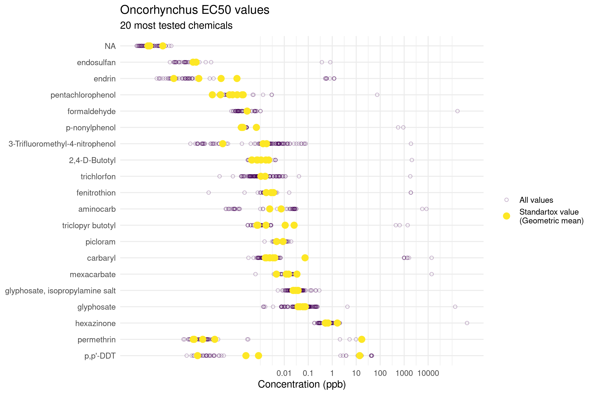

Standartox
================

[](https://CRAN.R-project.org/package=standartox)
[](https://cran.r-project.org/package=standartox)

Standartox is a database and tool facilitating the retrieval of
ecotoxicological test data. It is based on the [EPA ECOTOX
database](https://cfpub.epa.gov/ecotox/) as well as on data from several
other chemical databases and allows users to filter and aggregate
ecotoxicological test data in an easy way. It can be accessed via this
R-package [standartox](https://github.com/andschar/standartox).
Ecotoxicological test data is used in environmental risk assessment to
calculate effect measures such as [TU - Toxic
Units](https://en.wikipedia.org/wiki/Toxic_unit) or [SSD - Species
Sensitivity Distributions](https://edild.github.io/ssd/) to asses
environmental toxicity of chemicals.

## Installation

***NOTE:*** Currently v0.0.2 is only available here on GitHub.

``` r
# install.packages('standartox') # Currently only available on GitHub
remotes::install_github('andschar/standartox') # development version
```

## Functions

Standartox mainly consists of the functions `stx_catalog()` and
`stx_datay()`. The former allows you to retrieve a summary catalog of
the data. The latter fetches toxicity values from the database. There
are also `stx_chem()`, `stx_taxa()` and `stx_meta()` funcitons which
fetch chemical, taxonomic and meta data respectively.

### `stx_catalog()`

The function returns a list of all possible arguments that can bes use
in `stx_query()`.

``` r
require(standartox)
catal = stx_catalog()
names(catal)
```

    ##  [1] "date_compiled"           "standartox_version"     
    ##  [3] "cas"                     "chem_class"             
    ##  [5] "cname"                   "ref_author"             
    ##  [7] "ref_number"              "ref_title"              
    ##  [9] "ref_year"                "class"                  
    ## [11] "continent"               "family"                 
    ## [13] "genus"                   "group"                  
    ## [15] "habitat"                 "order"                  
    ## [17] "rank"                    "taxon"                  
    ## [19] "casnr"                   "cl_id"                  
    ## [21] "concentration"           "concentration_orig"     
    ## [23] "concentration_type"      "concentration_unit"     
    ## [25] "concentration_unit_orig" "duration"               
    ## [27] "duration_orig"           "duration_unit"          
    ## [29] "duration_unit_orig"      "effect"                 
    ## [31] "endpoint"                "endpoint_group"         
    ## [33] "exposure"                "qualifier"              
    ## [35] "ref_number"              "result_id"              
    ## [37] "tl_id"

``` r
catal$endpoint # access the parameter top five endpoints
```

|      n | variable |
| -----: | :------- |
| 202306 | NOEL     |
| 191672 | NR       |
| 162103 | LOEL     |
| 152748 | NOEC     |
| 135906 | LC50     |

### `stx_data()`

The function allows you to retrieve all the Standartox data.

    ## Retrieving Standartox data..

## Example: *Oncorhynchus*

Let’s say, we want to retrieve the 20 most tested chemicals on the genus
*[Oncorhynchus](https://en.wikipedia.org/wiki/Oncorhynchus)*. We allow
for test durations between 48 and 120 hours and want the tests
restricted to active ingredients only. Since we are only interested in
the half maximal effective concentration, we choose XX50 as our
endpoint. As an aggregation method we choose the geometric mean. The
code below makes use of the data.table package.

``` r
require(data.table)
require(standartox)
# Retrieve the data
dat = stx_data()
```

    ## Retrieving Standartox data..

``` r
tax = stx_taxa()
```

    ## Retrieving Standartox taxa information..

``` r
che = stx_chem()
```

    ## Retrieving Standartox chemical information..

``` r
# Merge
dat2 = merge(dat, tax, by = 'tl_id', all.x = TRUE)
dat2 = merge(dat2, che, by = 'cl_id', all.x = TRUE)
dat3 = dat2[
  endpoint == 'LC50' &
  duration %between% c(48, 120) &
  concentration_type == 'active ingredient' &
  grepl('Oncorhynchus', taxon) # fish genus
]
```

We subset the retrieved data to the 20 most tested chemicals and plot
the result.

``` r
cas20 = dat3[ , .N, cas ][ order(-N) ][1:20]
dat4 = dat3[ cas %in% cas20$cas ]
dat4_gmn = dat4[ , .(gmn = exp(mean(log(concentration), na.rm = TRUE))), .(cas, cname, taxon)]
```

``` r
require(ggplot2)
ggplot(dat4, aes(y = cname)) +
  geom_point(aes(x = concentration, col = 'All values'),
             pch = 1, alpha = 0.3) +
  geom_point(data = dat4_gmn,
             aes(y = reorder(cname, -gmn), x = gmn, col = 'Standartox value\n(Geometric mean)'),
             size = 3) +
  scale_x_log10(breaks = c(0.01, 0.1, 1, 10, 100, 1000, 10000),
                labels = c(0.01, 0.1, 1, 10, 100, 1000, 10000)) +
  scale_color_viridis_d(name = '') +
  labs(title = 'Oncorhynchus EC50 values',
       subtitle = '20 most tested chemicals',
       x = 'Concentration (ppb)') +
  theme_minimal() +
  theme(axis.title.y = element_blank())
```

<!-- -->

## Article

The article on Standartox is published
[here](https://www.mdpi.com/2306-5729/5/2/46).

## Contributors

### Want to contribute?

Check out our [contribution guide
here](https://github.com/andschar/standartox/blob/master/CONTRIBUTING.md).

### Meta

  - Please report any [issues, bugs or feature
    requests](https://github.com/andschar/standartox/issues)
  - License: MIT
  - Get citation information for the standartox package in R doing
    `citation(package = 'standartox')`
